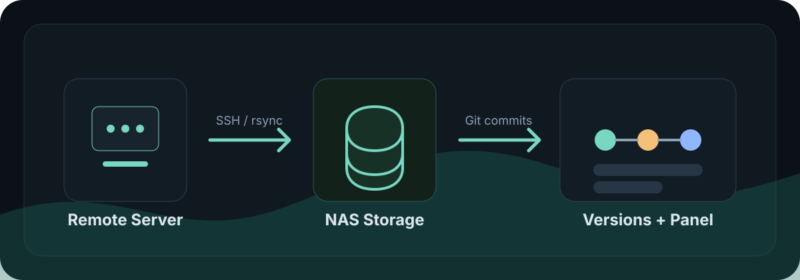

<div align="center">
  <h1>VaultBridge</h1>
  <p>Self-hosted NAS backup panel for pulling website files over SSH, syncing with rsync, and keeping every backup as Git history.</p>

  <p>
    <a href="#quickstart">Quickstart</a> ·
    <a href="#features">Features</a> ·
    <a href="#tech-stack">Tech Stack</a> ·
    <a href="#restore-a-version">Restore</a>
  </p>

  <p>
    
    
    
    
    
  </p>
</div>

<p align="center">
  
</p>

VaultBridge is built for small server operators who host websites on a VPS, aaPanel/BaoTa, or another Linux server and want simple scheduled backups on a NAS. The source server is treated as read-only: VaultBridge connects over SSH, copies files into a local NAS folder, commits the snapshot to Git, and lets you download any historical version as a zip archive.

> Status: focused self-hosted backup tool. Test restores before relying on it for production recovery.

## Tech Stack

| Layer | Technology | Purpose |
| --- | --- | --- |
| Web API | FastAPI, Uvicorn | Serves the backup panel and JSON API. |
| UI | Vanilla HTML, CSS, JavaScript | Single-page control panel without a frontend build step. |
| Scheduling | APScheduler | Runs daily or weekly backup jobs. |
| Remote access | Paramiko, OpenSSH, sshpass | Tests SSH connections, browses folders, and supports password-based SSH in Docker. |
| Transfer | rsync, SFTP, remote tar fallback | Performs incremental copies and compatibility fallback transfers. |
| Versioning | Git | Stores each backup snapshot as a commit and builds version archives. |
| State | SQLite, local data directory | Stores jobs, run history, encrypted credentials, and app state. |
| Deployment | Docker, Docker Compose | Packages the panel with rsync, SSH tools, and Git for NAS deployment. |

## Features

- Create, edit, pause, resume, stop, and delete website backup jobs from a web panel.
- Schedule daily or weekly backups at a configured time.
- Pull files from remote Linux servers over SSH while keeping the source server read-only.
- Use rsync for fast incremental transfers and automatic resume after interruptions.
- Commit every backup snapshot into Git for efficient version history.
- Browse versions and download any historical commit as a zip archive.
- Encrypt stored SSH passwords with a local Fernet key.
- Fall back to remote tar streaming or SFTP recursion when rsync is unavailable.

## Quickstart

Docker Compose is the recommended path for a NAS or small always-on machine.

```bash
git clone https://github.com/Ha22yX/VaultBridge.git
cd VaultBridge
cp .env.example .env
python3 -c "from cryptography.fernet import Fernet; print(Fernet.generate_key().decode())"
```

Put the generated key into `.env` as `BACKUP_SECRET_KEY`, then set `VAULTBRIDGE_BACKUP_HOST_DIR` to the NAS folder where backups should live.

```bash
docker compose up -d --build
```

Open the panel:

```text
http://<nas-ip>:8728
```

The Docker image includes `rsync`, `sshpass`, `openssh-client`, and `git`.

## First Backup Job

Create a job in the web panel with values like these:

| Field | Example |
| --- | --- |
| SSH host | `203.0.113.10` |
| SSH user | `root` or a dedicated read-only SSH user |
| SSH port | `22` |
| Backup paths | `/www/wwwroot` |
| Target path | `/server-backups/example-site` |
| Schedule | Daily at `03:00` |

For the bundled Docker Compose setup, map your NAS folder into the container and use a target path under `/server-backups`. The same host folder is also mounted through the compatibility path defined in `docker-compose.yml`, so older jobs can continue to work.

## How Backups Work


VaultBridge prefers this transfer order:

1. `rsync` over SSH for incremental syncs.
2. Remote `tar` streaming when local `rsync` is unavailable.
3. SFTP recursion as the compatibility fallback.

Each job creates this layout under its target folder:

```text
<target path>/
  repository/
    .git/
    snapshot/
      www/wwwroot/...
  archives/
    vaultbridge-<commit>.zip
```

Only `repository/snapshot` is versioned. Generated zip files live outside Git history.

## Configuration

| Variable | Default | Description |
| --- | --- | --- |
| `VAULTBRIDGE_HOST` | `0.0.0.0` in Docker | Bind address for the web app. |
| `VAULTBRIDGE_PORT` | `8728` | Web panel port. |
| `VAULTBRIDGE_DATA_DIR` | `/app/data` in Docker | SQLite database, encryption key, and app state. |
| `BACKUP_SECRET_KEY` | auto-generated if absent | Fernet key used to encrypt stored SSH passwords. Set this explicitly in production. |
| `VAULTBRIDGE_BACKUP_HOST_DIR` | `./backups` | Host folder mounted into Docker as `/server-backups` and the compatibility path in `docker-compose.yml`. |
| `VAULTBRIDGE_RSYNC_WORKERS` | `3` | Number of parallel rsync workers, clamped between 1 and 8. |
| `VAULTBRIDGE_RSYNC_RETRIES` | `2` | Retries per rsync shard after a dropped connection. |
| `VAULTBRIDGE_RSYNC_RESUME_RETRIES` | `10` | Whole-run automatic resume attempts before the run is marked failed. |

## Restore A Version

Open the Versions page, choose a backup job, select a commit, and download the generated zip. The archive is built from the Git commit, so it represents the snapshot exactly as it existed at that backup time.

You can also inspect the repository directly:

```bash
cd <target path>/repository
git log --oneline
git checkout <commit> -- snapshot
```

## Development

```bash
python -m venv .venv
.\.venv\Scripts\activate
pip install -e .[dev]
python -m app.main
```

Open `http://127.0.0.1:8728`.

Run the test suite:

```bash
pytest
```

On Windows, install cwRsync for the fastest local development transfer path:

```powershell
choco install rsync -y
```

## Project Layout

```text
app/
  main.py          FastAPI routes
  backup.py        Backup orchestration, Git commits, run control
  rsync_client.py  rsync discovery, command building, progress parsing
  ssh_client.py    SSH, SFTP, tar fallback helpers
  static/          Single-page web UI
scripts/
  install_nas.sh   Optional systemd install helper
tests/             Regression tests for paths, rsync, Docker config
```

## Security Notes

- Do not commit real SSH passwords, server keys, panel API keys, or `.env` files.
- Prefer a dedicated SSH user with read access to the folders you need to back up.
- Keep `BACKUP_SECRET_KEY` stable after deployment; changing it prevents existing encrypted passwords from being decrypted.
- Test restore downloads regularly. A backup that has never been restored is only a hypothesis.

## Roadmap

- Backup verification after each run.
- Retention policies for old archives and commits.
- Optional notifications for failed or completed backups.
- Committed UI screenshots once the panel copy is finalized.

## License

No license file is included yet. Add a license before distributing this project as an open-source package.
